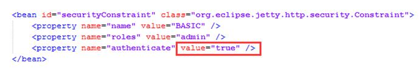
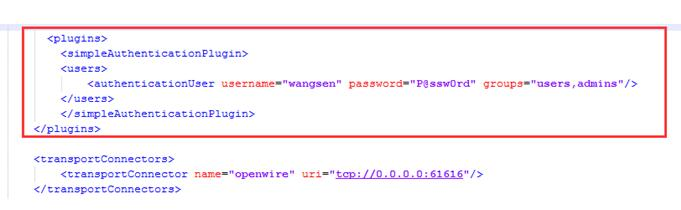

###安装jdk(activemq依赖jdk)
- 下载jdk.tar.gz
- 配置环境变量
```ini
#命令
nano /etc/profile
#环境变量
export JAVA_HOME=/usr/local/jdk1.7.0_79
export PATH=$PATH:$JAVA_HOME/bin
#环境变量生肖
[root@localhost centos]# source /etc/profile
```
- 使用命令判断成功与否
```
#命令
echo $JAVA_HOME
#打印信息
/usr/local/jdk1.7.0_79
```
###安装activemq
- 下载apache-activemq-5.13.4-bin.tar.gz
- 解压到/usr/local/目录下，名称改为apache-activemq
- 确定./bin/activemq start 和 stop 可以启动关闭
- 生产软链接到 /etc/init.d/ 下
```
#执行命令
ln -s  /usr/local/apache-activemq/bin/activemq   /etc/init.d/
```
- 检查 链接的权限是否有执行权限
```
chmod +x /etc/init.d/activemq
```
- 加入管理服务
```
chkconfig --add  activemq
```
- 测试命令
```
service activemq start/stop/status
```
- 设置管理 ON状态
```
chkconfig activemq  on
```
- 配置activemq的java_home 和CMD
```
nano /usr/local/apache-activemq/bin/env
#最后2行改成 
JAVA_HOME=/usr/local/jdk1.7.0_79/jre
JAVACMD=/usr/local/jdk1.7.0_79/jre/bin/java
```
- 如果没有步骤9可能造成(service activemq start)
  - ERROR: Configuration variable JAVA_HOME or JAVACMD is not defined correctly. (JAVA_HOME=’’, JAVACMD=’java’)

###Activemq设置用户名密码

- 配置控制台登录用户名密码

在jetty.xml配置文件中，红框中的值改为true，控制台的登录用户名密码保存在jetty-realm.properties文件中

- 配置客户端连接用户名和密码

在activemq.xml配置文件中，红色框中是配置的用户名和密码

<span class="pl-k">
```
<plugins>
     <simpleAuthenticationPlugin>
        <users>
           <authenticationUser username="wangsen" password="P@ssw0rd" groups="users,admins"/>
        </users>
     </simpleAuthenticationPlugin>
</plugins>
  
<transportConnectors>
     <transportConnector name="openwire" uri="tcp://0.0.0.0:61616"/>
</transportConnectors>
```
</span>

