#####使用redis-sentinel(哨兵)集群 ##########


###1.安装redis


安装方法可以下载redis.tar.gz，也可以使用命令安装redis，用例使用的是命令安装：apt-get install redis-server。
###2.测试


测试安装的redis是否正常
###3.主从配置及测试
```
#主从配置我们将安装3台redis服务器
主	Redis1	172.17.16.7	6379
从	Redis2	172.17.16.21	6379
从	Redis3	172.17.16.22	6379
```
3台服务器如上面表格所示

- A:首先修改主服务器Redis1
```
vi /etc/redis/redis.cnf
#做如下修改，其余的保持不变
masterauth  redispass
requirepass  redispass
bind 127.0.0.1注释掉，前面加#
```
- B:修从服务器的配置，从服务Redis2和Redis3配置相同
```
slaveof  172.17.16.7 6379
masterauth  redispass
requirepass  redispass
bind 127.0.0.1注释掉，前面加#
```
- C:分别启动主从服务器

 主从服务器从属信息查看如下：
```
#主服务器检查命令
redis-cli -h 127.0.0.1 -a redispass info replication
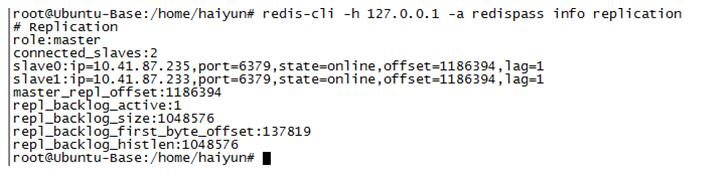
#从服务器检查命令
redis-cli -h 127.0.0.1 -a redispass info replication
```

- 同步测试检查
 - 主服务器Redis1
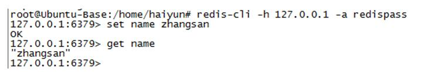

 - 从服务器Redis2和Redis3检查
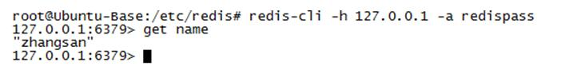

###4.Redis sentinel配置


- sentinel主要功能就是为Redis M-S(master,slaves)集群提供了
1)master存活检测
2)集群中M-S服务监控
3) 自动故障转移,M-S角色转换等能力,
- 修改主服务器Redis1、Redis2、Redis3，配置相同
```
#vi命令
vi /etc/redis/ sentinel.conf
#修改信息
port 26379
sentinel monitor mymaster 172.17.16.7 6379 2
sentinel auth-pass mymaster redispass
sentinel down-after-milliseconds mymaster 30000
sentinel failover-timeout mymaster 900000
sentinel parallel-syncs mymaster 1
```
- 在3个服务器中以sentinel模式启动redis-server，
```
root@Ubuntu-Base:/etc/redis# redis-sentinel sentinel.conf
```
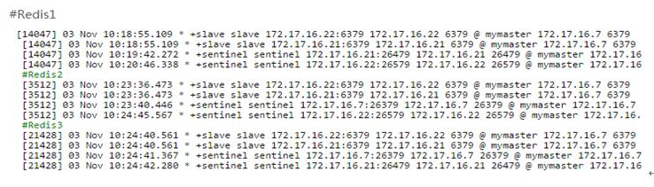
- 关掉Redis3上的redis-server服务
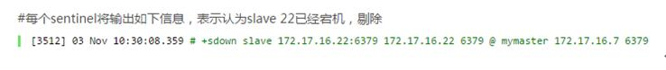
- 重新启动Redis3上的redis-server服务
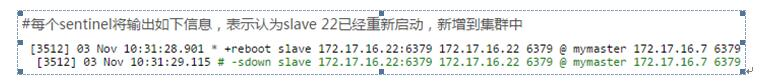
- 关掉主Redis1的redis-server服务
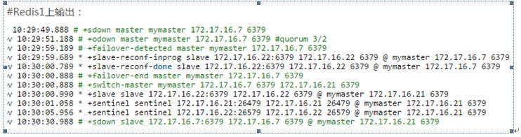

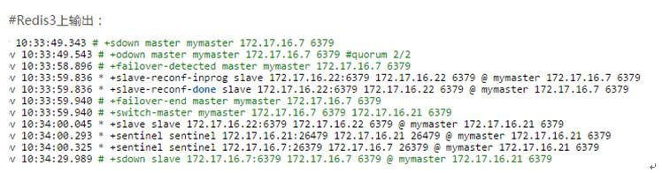


- 查看主从关系(redis1为主,redis3为从,如果redis1重新启动,也将为从服务器加入到新的集群)
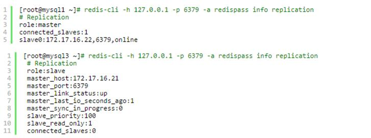
- 重新启动Redis1，检查Redis2的主从关系
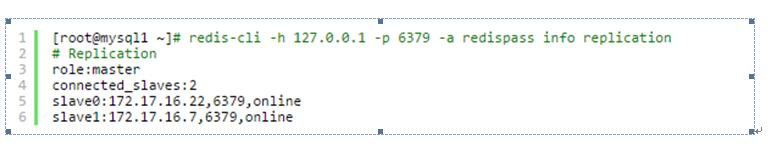
- 切换成功

###5.spring集成redis的集群

- 在pom中引入需要的jar

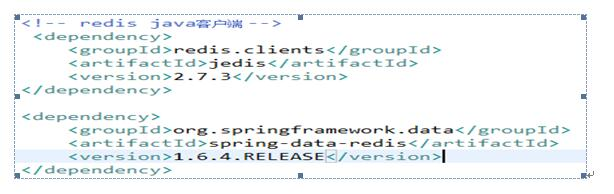
- application-redis.xml配置
```
<bean id="poolConfig" class="redis.clients.jedis.JedisPoolConfig">  
	<property name="maxTotal" value="100" />  
	<property name="minIdle" value="50" />  
	<property name="maxWaitMillis" value="3000" />  
	<property name="maxIdle" value="50" />  
	<property name="testOnBorrow" value="true" />  
	<property name="testOnReturn" value="true" />  
	<property name="testWhileIdle" value="true" />  
</bean>  
<bean id="sentinelConfiguration" class="org.springframework.data.redis.connection.RedisSentinelConfiguration">  
	<property name="master">  
		<bean class="org.springframework.data.redis.connection.RedisNode">  
			<!-- 配置的redis的master名称 -->
			<property name="name" value="mymaster"/>  
		</bean>  
	</property>  
	<property name="sentinels"> 
		<!-- 可以以集合方式配置多个sentine --> 
		<set>  
			<bean class="org.springframework.data.redis.connection.RedisNode">  
				<constructor-arg name="host"  value="10.41.87.233"/>  
				<constructor-arg name="port"  value="26379"/>  
			</bean>  
		</set>  
	</property>  
</bean>  
<bean id="connectionFactory" class="org.springframework.data.redis.connection.jedis.JedisConnectionFactory">
	<!-- 配置的redis的客户端密码 -->
	<property name="password" value="redispass"/>
	<constructor-arg name="sentinelConfig" ref="sentinelConfiguration"/>  
	<constructor-arg name="poolConfig" ref="poolConfig"/>  
</bean>  
<bean id="redisTemplate" class="org.springframework.data.redis.core.StringRedisTemplate">  
	<property name="connectionFactory" ref="connectionFactory" />  
	<!-- ----- 注意:如果没有配置keySerializer和valueSerializer会造成只能存储string类型------------- -->
	<property name="keySerializer">  
            <bean class="org.springframework.data.redis.serializer.StringRedisSerializer"/>  
        </property>  
        <property name="valueSerializer">  
            <bean class="org.springframework.data.redis.serializer.JdkSerializationRedisSerializer"/>  
        </property>  
</bean>
```
